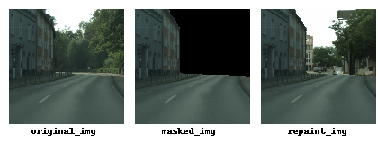

## 基于DDPM的街景修复
## Street Scene Repaint Based on DDPM

  使用了基础的DDPM对街景图像数据集进行训练, 其使用Unet2D网络。

  数据集来自Cityscapes(www.cityscapes-dataset.com), 经过中心裁剪和resize得到10000张128x128分辨率的三通道图像。

  在图像修复过程中, 首先对被遮罩的图像进行加噪, 输入给模型推理后得到去噪后的图像, 再使用去噪后的图像对缺失部分填充, 以达到修复的功能。

  已训练模型可下载 (https://huggingface.co/Drawin/DDPM-Street-Scene-Repaint/)

  The basic DDPM was employed for the training of a street scene image dataset, utilizing the Unet2D network. 

  The dataset, sourced from Cityscapes (www.cityscapes-dataset.com), comprises 10,000 three-channel images with a resolution of 128x128, obtained through central cropping and resizing.

  During the image restoration process, the initially masked images are subjected to noise addition. The resultant noisy images are then input into the model for inference, yielding denoised images. Subsequently, the denoised images are utilized to fill in the missing regions, serving the purpose of image restoration.

  The trained model can be downloaded ( https://huggingface.co/Drawin/DDPM-Street-Scene-Repaint/ )

  

### 运行环境(Environment):

ubuntu 20.04 - 
pytorch 2.0.0 - 
cuda 11.8

### 建议资源(Suggested resources):

train:     VRAM>20GB

repaint: VRAM>2GB

### 源码说明(Source description)

#### > diffusers.ipynb :

模型定义与训练. Model definition and training.

#### > repaint.ipynb : 

模型推理与图像修复. model inference and image repaint.

#### > DenoisePipeline : 

重写的推理管道. Rewritten denoising pipeline.

### 参考(reference):

Thanks to huggingface/diffusers for the resource

https://github.com/huggingface/diffusers

https://huggingface.co/docs/diffusers/api/pipelines/ddpm

https://colab.research.google.com/github/huggingface/notebooks/blob/main/diffusers/training_example.ipynb

##### 课程项目, 仅供参考, 若有问题请致信 drawin_feng@qq.com
